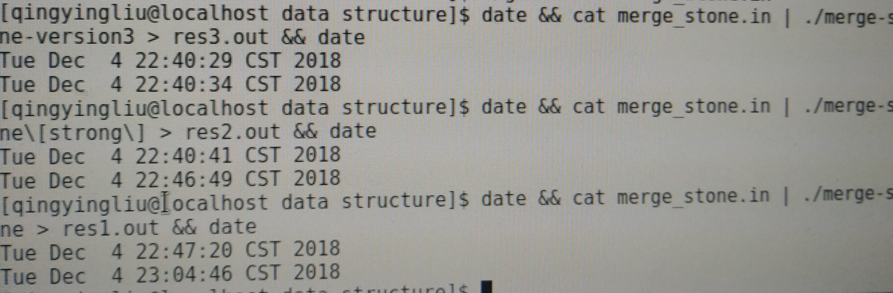

## 问题描述
在一个圆形操场的四周摆放着n 堆石子。现要将石子有次序地合并成一堆。规定每次只能选相邻的2 堆石子合并成新的一堆，并将新的一堆石子数记为该次合并的得分。求将n堆石子合并成一堆的最小得分和最大得分。

要求：
- 采用的算法：动态规划
- 要求给出计算表格和结果

## 算法描述

读完题目之后，我们可以发现题目具有这两个特点：
1. 每次只能合并相邻两堆石子
2. 圆形操场

特点1限制了此题不可以使用贪心算法，而应该使用更加准确的算法——动态规划，具体地说，是区间类型的动态规划。而对于特点二，我们采用“断链为环”的思想去解决这个问题。

### 动态规划的正确性
前面已经说过，虽然这一道题目的描述让人非常容易联想到贪心算法，但是应用贪心算法来解决这个问题是错误的，可以看下面这个例子：

**Example**

我们假如5堆的石子，其中石子数分别为7，6，5，7，100，我们假设求合并的最小得分。
- 按照贪心算法，合并的过程如下：
   1. 第一次合并7，6，5，7，100，结果为5+6=11
   2. 第二次合并7，11，7，100，结果为7+11=18
   3. 第三次合并18,7,100, 结果为18+7=25
   4. 第四次合并25,100，结果为100+25=125
   此时，贪心思想的合并已经结束，总得分为：11+18+25+125=179
- 另外一种方案：
    1. 第一次合并7，6，5，7，100，结果为7+6=13
   1. 第二次合并13，5，7，100，结果为5+7=12
   2. 第三次合并13,12,100, 结果为13+12=25
   3. 第四次合并25,100，结果为100+25=125
   此时，另外方案的合并已经结束，总得分为：13+12+25+125=175

通过对比可以发现，显然此题使用贪心算法是不正确的。

对于本题，很显然满足动态规划的最优子结构和和重叠子问题的性质，所以我们可以考虑使用动态规划求解。

最优子结构的证明:
如果一个区间$[i,j]$的最大得分是$max(i,j)$,那么它必然是由两个最大得分的子区间($max(i,k)$,$max(k+1,j)$)的得分合并而成，即
   $$max(i,j)=max(i,k)+max(k+1,j)+sum(i,j), k \in (i,j)$$
否则，会存在一个更大的子区间的得分$S(i,k)>max(i,k)$,$S(k+1,j)>max(k+1,j)$使得
   $$S(i,j)=S(i,k)+S(k+1,j)+sum(i,j) > max(i,j) , k \in (i,j)$$
这和我们假设$max(i,j)$是区间$[i,j]$的最大得分矛盾，所以不存在一个更大子区间的得分。所以最大得分的子区间的得分也是子区间的最大得分。

最小得分同上理。

至于重叠子问题，是比较显然的，因为区间$(i,j)$的计算依赖于子区间$(i,k),(k+1,j)$的计算。

通过以上分析，动态规划是适合解决这道问题的。

### 动态规划的描述
其实在前面就已经多次提到了把这一道题目“区间化”，也就是说，把两次合并的石子看出是由两个区间合并而成的结果。我们假设区间$(i,j)$的最大得分为$dpmax(i,j)$，最小得分为$dpmin(i,j)$，那么有：
$$dpmax(i,j) = max(dpmax(i,k)+dpmax(k+1,j)+sum(i,j)),k \in (i,j) \tag{1}$$
$$dpmin(i,j) = min(dpmin(i,k)+dpmin(k+1,j)+sum(i,j)),k \in (i,j) \tag{2}$$

上面的公式表达了把区间$(i,j)$的计算转换成了子区间的计算，所以我们可以通过迭代的方式或者记忆化搜索的方式进行计算。

### 时间复杂度
因为根据表达式可以知道，存在三个遍历，我们需要用三重循环去遍历，故时间复杂度为$O(n^3)$。如果计算100次，n的范围是$(1,1000)$，那么这需要跑20多分钟才能运行完毕，显然这样太慢了。幸运的是，我们可以使用平行四边形优化去把$O(n^3)$的时间复杂度降低到$O(n^2)$，让20多分钟的计算时间压缩到5秒钟就可以完成。

### 平行四边形优化
在**Efficient Dynamic Programming Using Quadrangle Inequalities**这篇文章中提到了如何将
$$c(i,j) = w(i,j) + min(c(i,k)+c(k+1,j)) \tag{3}$$
的类型的动态规划的时间复杂度降低到$O(n^2)$。我在这里做一个梳理，具体证明请到原文查阅。

**定理1**： 如果$(1)$式的$w$满足平行四边形不等式,即
$$w(i,j)+w(i',j')<=w(i,j')+w(i',j) \ \ \ \ \ \ \ \ \ i<=i'<=j<=j' \tag{4}$$
且满足区间单调性
$$w(i,j)<=w(i',j') \ \ \ \ \ \ [i，j] \subset [i',j'] \tag{5}$$
那么$(3)$的动态规划的计算可以加速到$O(n^2)$。

**定理2**： 如果$(3)$式的$w$满足定理(1)，那么$c$也满足平行四边形不等式.

**定理3**： 如果$(3)$式的$c$满足平行四边形不等式，那么有：
$$K_c(i,j)<=K_c(i,j+1)<=K_c(i+1,j+1) \tag{6}$$
其中$K_c$表示最大的$k$使得最小值成立。

显然，我们计算最小得分$(2)$式满足平行四边形不等式，所以我们可以把k优化成$(6)$式，使得计算最小得分的动态规划的时间复杂度为$O(n^2)$

### 其他优化
对于最大值，根据https://www.luogu.org/blog/Hurricane-zjz/solution-p1880 这篇文章可以知道，最大值存在这样的性质：即总是在两个端点的最大者中取到。即：
$$dpmax(i,j)=max(dpmax(i,j),dpmax(i+1,j))+sum(i,j) \tag{7}$$

还有就是在计算$sum(i,j)$的时候使用前缀和处理，这样就不用每次都用循环计算$(i,j)$的和了。

## 算法实现

使用二维数组$dpmax$和$dpmin$来保存子区间的计算结果，二维数组$pi$保存$K_c$的值，$sum$保存前缀和。通过遍历区间的起始位置和长度,根据式(1)和(2)来计算即可。值得注意的是，区间的长度应该式从小到大，因为我们需要先计算子问题再去计算大问题。
 
## 实验结果
假设我们输入4个石子，它们的得分相应是4,4,5,9，那么最大值是54，最小值是43.
$dpmin$的表格是：
```

   0   |   8   |  21   |  43   |  60   |  76   |  INF  |  INF  |

-------|-------|-------|-------|-------|-------|-------|-------|

   0   |   0   |   9   |  27   |  44   |  60   |  INF  |  INF  |

-------|-------|-------|-------|-------|-------|-------|-------|

   0   |   0   |   0   |  14   |  31   |  44   |  INF  |  INF  |

-------|-------|-------|-------|-------|-------|-------|-------|

   0   |   0   |   0   |   0   |  13   |  25   |  INF  |  INF  |

-------|-------|-------|-------|-------|-------|-------|-------|

   0   |   0   |   0   |   0   |   0   |   8   |  INF  |  INF  |

-------|-------|-------|-------|-------|-------|-------|-------|

   0   |   0   |   0   |   0   |   0   |   0   |  INF  |  INF  |

-------|-------|-------|-------|-------|-------|-------|-------|

   0   |   0   |   0   |   0   |   0   |   0   |   0   |  INF  |

-------|-------|-------|-------|-------|-------|-------|-------|

   0   |   0   |   0   |   0   |   0   |   0   |   0   |   0   |

-------|-------|-------|-------|-------|-------|-------|-------|
```
$dpmax$的表格是：
```

   0   |   8   |  22   |  54   |  80   | 110   |   0   |   0   |

-------|-------|-------|-------|-------|-------|-------|-------|

   0   |   0   |   9   |  32   |  54   |  80   |   0   |   0   |

-------|-------|-------|-------|-------|-------|-------|-------|

   0   |   0   |   0   |  14   |  32   |  54   |   0   |   0   |

-------|-------|-------|-------|-------|-------|-------|-------|

   0   |   0   |   0   |   0   |  13   |  30   |   0   |   0   |

-------|-------|-------|-------|-------|-------|-------|-------|

   0   |   0   |   0   |   0   |   0   |   8   |   0   |   0   |

-------|-------|-------|-------|-------|-------|-------|-------|

   0   |   0   |   0   |   0   |   0   |   0   |   0   |   0   |

-------|-------|-------|-------|-------|-------|-------|-------|

   0   |   0   |   0   |   0   |   0   |   0   |   0   |   0   |

-------|-------|-------|-------|-------|-------|-------|-------|

   0   |   0   |   0   |   0   |   0   |   0   |   0   |   0   |

-------|-------|-------|-------|-------|-------|-------|-------|
```
在运行时间方面，对于100组数据n在1000之内的数据，没有优化过的动态规划运行了17分钟，只用平行四边形优化的跑了6分钟，用平行四边形优化和最大的的性质优化的跑了5秒钟。如下图所示：

第一组是：用平行四边形优化和最大的的性质优化
第二组是：只用平行四边形优化的
第三组是：没有优化过的动态规划

## 问题分析
1. 在使用动态规划的时候应该先计算子问题，在我们这一题，我们应该根据区间的长度由小到大地去计算.
2. 在使用平行四边形优化的时候需要注意边界条件，特别是注意等号，如果没有等号，会出现错误的结果。

##  心得与体会
通过本次实验，我学会了使用动态规划去解决问题，以及分析它的时间复杂度。最重要的是，我学会了如何去把平行四边形优化应用到动态规划。
在本次实验中，我去解释和证明了石子合并的最优子问题和重叠子问题，然后说明了动态规划的解决方法，最后给出了三个定理去把动态规划优化到$O(n^2)$。在写这次作业之前，我还特意去看了平行四边形优化的论文，那里给出了严格的数学证明，让人看了收益匪浅。

## 任务分工及所完成的状况
本次任务只有我刘清影一人完成，题目任务要求全部完成，在此基础上我还加了平行四边形优化，让$O(n^3)$的时间复杂度优化到$O(n^2)$，优化后的效果非常好，让十几分钟的程序优化到几秒钟就能完成。

## 参考文献
[1] “Efficient Dynamic Programming Using Quadrangle Inequalities ”， F. Frances Yao Xerox Palo Alto Research Center Palo Alto, California ， http://www.cs.ust.hk/mjg_lib/bibs/DPSu/DPSu.Files/p429-yao.pdf

## 源代码
